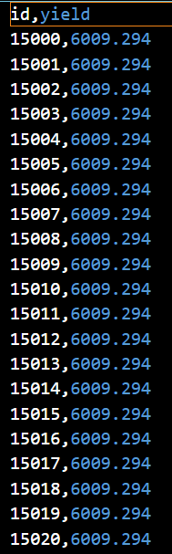

# Supervised-learning-csv
## Objectives
The goal of this project is to study a set of characteristics of fruit (such as clonesize, fruitmass, and seeds data) and predict the yield value using supervised learning techniques.

After training the model, different evaluation metrics were used to assess the accuracy of the predictions and compare different algorithms, this data is store in a file called sample_submission.csv.

## Project Overview

This project demonstrates a supervised regression workflow:

1. Load and explore a dataset stored in CSV format.

2. Preprocess numerical and categorical variables.

3. Split the data into training and testing subsets.

4. Train machine learning models to predict fruit yield.

5. Evaluate performance using common regression metrics (MAE, RMSE, R²).

6. Export predictions to a CSV file for analysis or submission.

## Results

